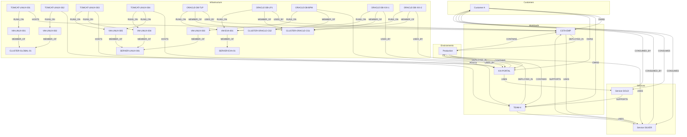

```mermaid
graph TD
  subgraph Customers [Customers]
    _customers_CUST_000001_md["Customer A"]
  end
  subgraph Environments [Environments]
    _environments_EV_CS1_PRO_md["Production"]
  end
  subgraph Infrastructure [Infrastructure]
    _infrastructure_IF_APS_TMC_001_md["TOMCAT-LINUX-001"]
    _infrastructure_IF_APS_TMC_002_md["TOMCAT-LINUX-002"]
    _infrastructure_IF_APS_TMC_003_md["TOMCAT-LINUX-003"]
    _infrastructure_IF_APS_TMC_004_md["TOMCAT-LINUX-004"]
    _infrastructure_IF_CLS_KVM_001_md["CLUSTER-GLOBAL-01"]
    _infrastructure_IF_DBI_ORA_001_md["ORACLE-DB-TLP"]
    _infrastructure_IF_DBI_ORA_002_md["ORACLE-DB-LP1"]
    _infrastructure_IF_DBI_ORA_003_md["ORACLE-DB-BPM"]
    _infrastructure_IF_DBI_ORA_004_md["ORACLE-DB-XXI-1"]
    _infrastructure_IF_DBI_ORA_005_md["ORACLE-DB-XXI-2"]
    _infrastructure_IF_DBP_ORA_001_md["CLUSTER-ORACLE-CS1"]
    _infrastructure_IF_DBP_ORA_002_md["CLUSTER-ORACLE-CS2"]
    _infrastructure_IF_SVR_EXA_001_md["SERVER-EXA-01"]
    _infrastructure_IF_SVR_LNX_001_md["SERVER-LINUX-001"]
    _infrastructure_IF_VMS_EXA_001_md["VM-EXA-001"]
    _infrastructure_IF_VMS_LNX_001_md["VM-LINUX-001"]
    _infrastructure_IF_VMS_LNX_002_md["VM-LINUX-002"]
    _infrastructure_IF_VMS_LNX_003_md["VM-LINUX-003"]
    _infrastructure_IF_VMS_LNX_004_md["VM-LINUX-004"]
    _infrastructure_IF_VMS_LNX_005_md["VM-LINUX-005"]
  end
  subgraph Services [Services]
    _services_SRV_CS1_SRVA_md["Service SILVER"]
    _services_SRV_CS1_SRVB_md["Service GOLD"]
  end
  subgraph Workloads [Workloads]
    _workloads_WL_CS1_EMP_md["CSTA-EMP"]
    _workloads_WL_CS1_TM4_md["TEAM-4"]
    _workloads_WL_CS1_XXI_md["XXI-PORTAL"]
  end
  _customers_CUST_000001_md -- "OWNS" --> _workloads_WL_CS1_EMP_md
  _customers_CUST_000001_md -- "OWNS" --> _workloads_WL_CS1_TM4_md
  _customers_CUST_000001_md -- "OWNS" --> _workloads_WL_CS1_XXI_md
  _customers_CUST_000001_md -- "CONSUMES" --> _services_SRV_CS1_SRVA_md
  _customers_CUST_000001_md -- "CONSUMES" --> _services_SRV_CS1_SRVB_md
  _environments_EV_CS1_PRO_md -- "CONTAINS" --> _workloads_WL_CS1_TM4_md
  _environments_EV_CS1_PRO_md -- "CONTAINS" --> _workloads_WL_CS1_XXI_md
  _environments_EV_CS1_PRO_md -- "CONTAINS" --> _workloads_WL_CS1_EMP_md
  _environments_EV_CS1_PRO_md -- "USES" --> _services_SRV_CS1_SRVA_md
  _infrastructure_IF_APS_TMC_001_md -- "HOSTS" --> _workloads_WL_CS1_EMP_md
  _infrastructure_IF_APS_TMC_001_md -- "RUNS_ON" --> _infrastructure_IF_VMS_LNX_001_md
  _infrastructure_IF_APS_TMC_002_md -- "HOSTS" --> _workloads_WL_CS1_TM4_md
  _infrastructure_IF_APS_TMC_002_md -- "RUNS_ON" --> _infrastructure_IF_VMS_LNX_002_md
  _infrastructure_IF_APS_TMC_003_md -- "HOSTS" --> _workloads_WL_CS1_XXI_md
  _infrastructure_IF_APS_TMC_003_md -- "RUNS_ON" --> _infrastructure_IF_VMS_LNX_004_md
  _infrastructure_IF_APS_TMC_003_md -- "RUNS_ON" --> _infrastructure_IF_VMS_LNX_005_md
  _infrastructure_IF_APS_TMC_004_md -- "HOSTS" --> _workloads_WL_CS1_XXI_md
  _infrastructure_IF_APS_TMC_004_md -- "RUNS_ON" --> _infrastructure_IF_VMS_LNX_005_md
  _infrastructure_IF_APS_TMC_004_md -- "RUNS_ON" --> _infrastructure_IF_VMS_LNX_004_md
  _infrastructure_IF_DBI_ORA_001_md -- "USED_BY" --> _workloads_WL_CS1_EMP_md
  _infrastructure_IF_DBI_ORA_001_md -- "MEMBER_OF" --> _infrastructure_IF_DBP_ORA_001_md
  _infrastructure_IF_DBI_ORA_001_md -- "RUNS_ON" --> _infrastructure_IF_VMS_EXA_001_md
  _infrastructure_IF_DBI_ORA_002_md -- "USED_BY" --> _workloads_WL_CS1_EMP_md
  _infrastructure_IF_DBI_ORA_002_md -- "MEMBER_OF" --> _infrastructure_IF_DBP_ORA_001_md
  _infrastructure_IF_DBI_ORA_002_md -- "RUNS_ON" --> _infrastructure_IF_VMS_EXA_001_md
  _infrastructure_IF_DBI_ORA_003_md -- "USED_BY" --> _workloads_WL_CS1_TM4_md
  _infrastructure_IF_DBI_ORA_003_md -- "MEMBER_OF" --> _infrastructure_IF_DBP_ORA_002_md
  _infrastructure_IF_DBI_ORA_003_md -- "RUNS_ON" --> _infrastructure_IF_VMS_LNX_003_md
  _infrastructure_IF_DBI_ORA_004_md -- "USED_BY" --> _workloads_WL_CS1_XXI_md
  _infrastructure_IF_DBI_ORA_004_md -- "MEMBER_OF" --> _infrastructure_IF_DBP_ORA_001_md
  _infrastructure_IF_DBI_ORA_004_md -- "RUNS_ON" --> _infrastructure_IF_VMS_EXA_001_md
  _infrastructure_IF_DBI_ORA_005_md -- "USED_BY" --> _workloads_WL_CS1_XXI_md
  _infrastructure_IF_DBI_ORA_005_md -- "MEMBER_OF" --> _infrastructure_IF_DBP_ORA_001_md
  _infrastructure_IF_DBI_ORA_005_md -- "RUNS_ON" --> _infrastructure_IF_VMS_EXA_001_md
  _infrastructure_IF_VMS_EXA_001_md -- "MEMBER_OF" --> _infrastructure_IF_SVR_EXA_001_md
  _infrastructure_IF_VMS_LNX_001_md -- "MEMBER_OF" --> _infrastructure_IF_CLS_KVM_001_md
  _infrastructure_IF_VMS_LNX_002_md -- "MEMBER_OF" --> _infrastructure_IF_CLS_KVM_001_md
  _infrastructure_IF_VMS_LNX_003_md -- "MEMBER_OF" --> _infrastructure_IF_SVR_LNX_001_md
  _infrastructure_IF_VMS_LNX_004_md -- "MEMBER_OF" --> _infrastructure_IF_SVR_LNX_001_md
  _infrastructure_IF_VMS_LNX_005_md -- "MEMBER_OF" --> _infrastructure_IF_SVR_LNX_001_md
  _services_SRV_CS1_SRVA_md -- "CONSUMED_BY" --> _customers_CUST_000001_md
  _services_SRV_CS1_SRVA_md -- "SUPPORTS" --> _workloads_WL_CS1_EMP_md
  _services_SRV_CS1_SRVB_md -- "CONSUMED_BY" --> _customers_CUST_000001_md
  _services_SRV_CS1_SRVB_md -- "SUPPORTS" --> _workloads_WL_CS1_TM4_md
  _workloads_WL_CS1_EMP_md -- "DEPLOYED_IN" --> _environments_EV_CS1_PRO_md
  _workloads_WL_CS1_EMP_md -- "USES" --> _services_SRV_CS1_SRVA_md
  _workloads_WL_CS1_TM4_md -- "DEPLOYED_IN" --> _environments_EV_CS1_PRO_md
  _workloads_WL_CS1_TM4_md -- "USES" --> _services_SRV_CS1_SRVA_md
  _workloads_WL_CS1_XXI_md -- "DEPLOYED_IN" --> _environments_EV_CS1_PRO_md
  _workloads_WL_CS1_XXI_md -- "USES" --> _services_SRV_CS1_SRVB_md
```